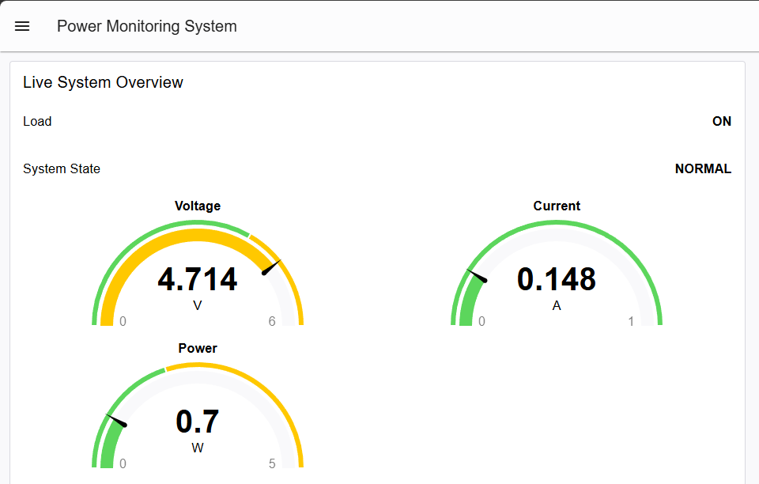
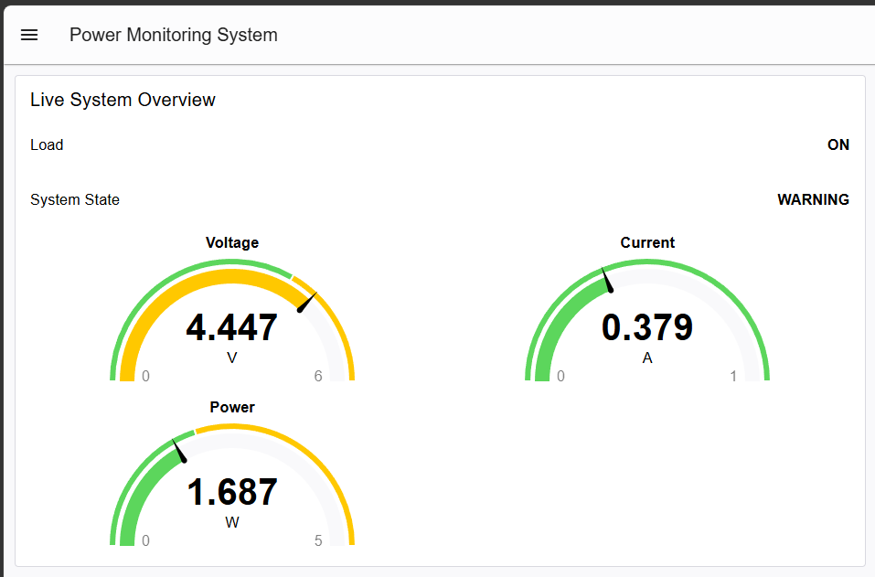
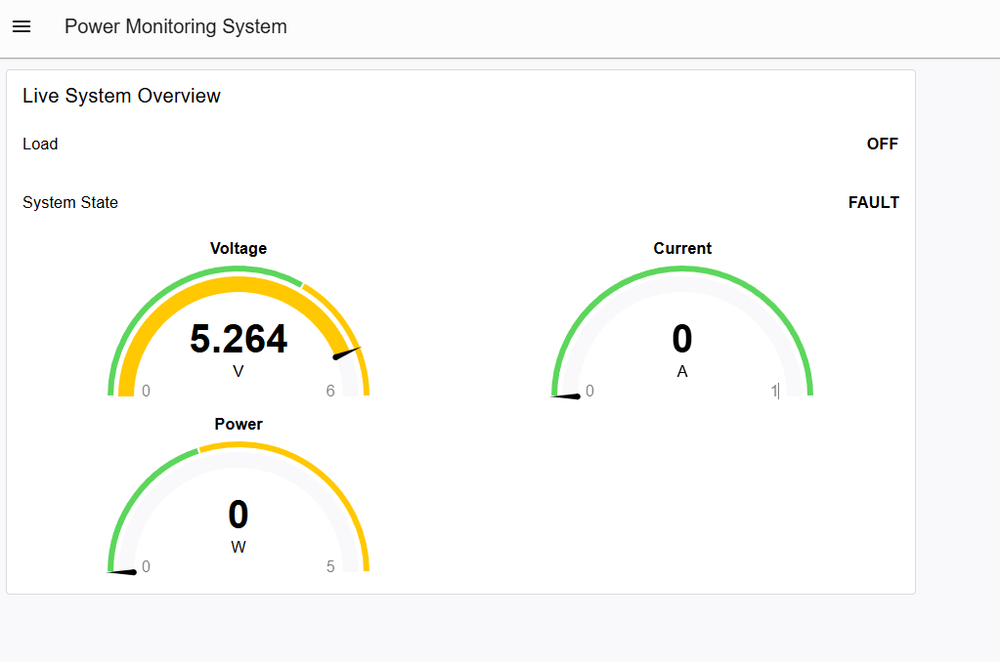

# ESP32 Power Monitoring and Protection System

An ESP32-based power monitoring and protection prototype that measures a 5 V DC load, detects abnormal current conditions, automatically disconnects the load during a fault, and streams live telemetry over Modbus TCP to a Node-RED dashboard.

## Overview

The system combines embedded sensing, protection logic, industrial-style communication, and a live HMI dashboard.

The ESP32 reads:

- Supply voltage through a resistor divider
- Load current through an ACS712 5 A current sensor
- Calculated electrical power

It then classifies the operating condition using a finite-state machine:

- `NORMAL`
- `WARNING`
- `FAULT`

If the measured current reaches the fault threshold, the ESP32 disables the load using a MOSFET module and latches the system in the `FAULT` state until the controller is reset.

Live telemetry is exposed through Modbus TCP and displayed in a Node-RED Dashboard 2.0 interface.

## Features

- ESP32-based embedded monitoring
- Voltage measurement using a resistor divider
- Current measurement using an ACS712 5 A sensor
- ADC averaging for more stable measurements
- Real-time power calculation
- `NORMAL / WARNING / FAULT` state machine
- Automatic MOSFET load cutoff
- Latched fault protection
- Wi-Fi connectivity
- Modbus TCP server
- Node-RED HMI dashboard
- Live voltage, current, power, system-state, and load-status monitoring

## System Architecture

```text
              5 V DC Supply
                    |
                    v
              +-------------+
              |   ACS712    |
              | Current     |
              | Sensor      |
              +-------------+
                    |
                    v
              +-------------+
              | MOSFET Load |
              |   Control   |
              +-------------+
                    |
                    v
                  Load
                    |
                   GND


5 V Supply
    |
    +---- Voltage Divider ----> ESP32 GPIO35

ACS712 OUT -------------------> ESP32 GPIO34

ESP32 GPIO26 -----------------> MOSFET SIG

ESP32
  |
  +---- Wi-Fi / Modbus TCP ----> Node-RED
                                  |
                                  v
                              HMI Dashboard
```

## Hardware

- ESP32 development board
- ACS712 5 A current sensor
- MOSFET switching module
- 5 V DC power supply
- 10 kΩ resistors for voltage divider
- 10 Ω 5 W power resistor used as the test load
- Breadboard
- Jumper wires

## Pin Connections

| Function | ESP32 Pin |
|---|---:|
| Voltage divider output | GPIO35 |
| ACS712 current output | GPIO34 |
| MOSFET control signal | GPIO26 |
| Common ground | GND |

The ACS712 is powered from the ESP32 5 V/VIN rail during testing, while the external 5 V adapter supplies the load circuit.

## Voltage Measurement

The voltage divider uses:

- `R1 = 20 kΩ`
- `R2 = 10 kΩ`

The ESP32 reads the divider midpoint and reconstructs the supply voltage using:

```text
Vin = Vadc × (R1 + R2) / R2
```

With the selected resistor values:

```text
Vin = Vadc × 3
```

## Current Measurement

The ACS712 5 A sensor is sampled through GPIO34.

The measured zero-current sensor voltage was approximately:

```text
2.540 V
```

The 5 A ACS712 sensitivity used in firmware is:

```text
0.185 V/A
```

Current is calculated using:

```text
Current = (Vsensor - Vzero) / sensitivity
```

Small readings around zero are filtered to reduce sensor noise.

## Protection Logic

The firmware uses three operating states.

### NORMAL

Current is below the warning threshold.

```text
Load: ON
```

### WARNING

Current exceeds the warning threshold but remains below the fault threshold.

```text
Load: ON
```

The system continues operating while reporting the warning condition.

### FAULT

Current reaches or exceeds the configured fault threshold.

```text
Load: OFF
```

The MOSFET is disabled and the fault is latched. The system remains in `FAULT` even after current falls to zero, preventing repeated automatic switching.

The fault latch is cleared by resetting the ESP32.

## Modbus TCP Register Map

The ESP32 exposes telemetry through Modbus TCP holding registers.

| Register | Value |
|---:|---|
| HR100 | Voltage × 1000 |
| HR101 | Current × 1000 |
| HR102 | Power × 1000 |
| HR103 | System state |
| HR104 | Load status |

### State Encoding

```text
0 = NORMAL
1 = WARNING
2 = FAULT
```

### Load Encoding

```text
0 = OFF
1 = ON
```

Example:

```text
[4660, 220, 1025, 0, 1]
```

represents:

```text
Voltage = 4.660 V
Current = 0.220 A
Power   = 1.025 W
State   = NORMAL
Load    = ON
```

## Node-RED Dashboard

Node-RED polls the ESP32 over Modbus TCP and displays:

- Voltage
- Current
- Power
- System state
- Load status

The dashboard provides a simple HMI-style interface for observing the embedded protection system in real time.

## Demo

### Functional Hardware Prototype


### Normal Operation



### Warning State



### Fault State



### Video Demo

[View the hardware and dashboard demo](media/demo.mp4)

## Software

### ESP32 Firmware

The firmware is built with PlatformIO using the Arduino framework.

Main responsibilities include:

- ADC sampling
- ACS712 calibration
- Voltage calculation
- Current calculation
- Power calculation
- State-machine logic
- MOSFET control
- Wi-Fi connection
- Modbus TCP communication

### PlatformIO Configuration

The project uses:

```ini
[env:esp32dev]
platform = espressif32
board = esp32dev
framework = arduino
monitor_speed = 115200

lib_deps =
    emelianov/modbus-esp8266
```

## Project Structure

```text
esp32-power-monitor/
├── media/
│   ├── hardware-prototype.jpg
│   ├── normal-state.png
│   ├── warning-state.png
│   ├── fault-state.png
│   └── demo.mp4
├── src/
│   └── main.cpp
├── .gitignore
├── platformio.ini
└── README.md
```

Wi-Fi credentials are stored locally in:

```text
include/secrets.h
```

and excluded from Git.

## Testing

The system was tested using multiple load conditions.

- A lighter load produced the `NORMAL` state
- A higher-current load produced the `WARNING` state
- A reduced fault threshold was used to verify the `FAULT` state and automatic MOSFET cutoff

The ACS712 measurement was also compared against a multimeter measurement across a known load resistor to verify that the sensed current was reasonably accurate.

## What I Learned

This project provided hands-on experience with:

- ESP32 ADC measurements
- Analog current sensing
- Voltage-divider design
- Embedded protection logic
- Finite-state machines
- MOSFET-based load control
- Modbus TCP
- Wi-Fi communication
- Node-RED
- HMI/dashboard development
- Hardware/software integration
- Debugging real sensor and wiring issues

## Future Improvements

Potential extensions include:

- Manual fault reset from the dashboard
- Energy tracking in Wh
- Peak-current tracking
- Alarm/event history
- Configurable thresholds from the HMI
- Persistent fault logs
- Improved enclosure and wiring
- Additional industrial communication and control features
